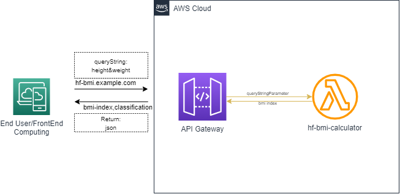

<!--
*** Thanks for checking out the Best-README-Template. If you have a suggestion
*** that would make this better, please fork the repo and create a pull request
*** or simply open an issue with the tag "enhancement".
*** Thanks again! Now go create something AMAZING! :D
***
***
***
*** To avoid retyping too much info. Do a search and replace for the following:
*** github_username, repo_name, twitter_handle, email, project_title, project_description
-->


<!-- PROJECT SHIELDS -->
<!--
*** I'm using markdown "reference style" links for readability.
*** Reference links are enclosed in brackets [ ] instead of parentheses ( ).
*** See the bottom of this document for the declaration of the reference variables
*** for contributors-url, forks-url, etc. This is an optional, concise syntax you may use.
*** https://www.markdownguide.org/basic-syntax/#reference-style-links
-->
[![LinkedIn][linkedin-shield]][linkedin-url]


<!-- PROJECT LOGO -->
<br />
<p align="center">
  <h3 align="center">HF BMI Calculator</h3>

  <p align="center">
    project_description
    <br />
    <a href="https://github.com/EsTelite/hf-bmi-application"><strong>Explore the docs »</strong></a>
    <br />
    <br />
    <a href="https://hf-bmi.ssdindo.com?height=150&weight=50">View Demo</a>
    ·
    <a href="https://github.com/EsTelite/hf-bmi-application">Report Bug</a>
    ·
    <a href="https://github.com/EsTelite/hf-bmi-application">Request Feature</a>
  </p>
</p>


<!-- TABLE OF CONTENTS -->
<details open="open">
  <summary><h2 style="display: inline-block">Table of Contents</h2></summary>
  <ol>
    <li>
      <a href="#about-the-project">About The Project</a>
      <ul>
        <li><a href="#built-with">Built With</a></li>
      </ul>
    </li>
    <li>
      <a href="#getting-started">Getting Started</a>
      <ul>
        <li><a href="#prerequisites">Prerequisites</a></li>
      </ul>
    </li>
    <li><a href="#usage">Usage</a></li>
    <li><a href="#roadmap">Roadmap</a></li>
    <li><a href="#contributing">Contributing</a></li>
    <li><a href="#license">License</a></li>
    <li><a href="#contact">Contact</a></li>
    <li><a href="#acknowledgements">Acknowledgements</a></li>
  </ol>
</details>


<!-- ABOUT THE PROJECT -->
## About The Project

[![Product Name Screen Shot][product-screenshot]]()

This is a simple API Service that can be used to calculate Body Mass Index (BMI) and classify BMI value. 
This API running on top of AWS Lambda and API Gateway, below are the picture for the flow requests:</br>
  <a href="https://github.com/EsTelite/hf-bmi-application">
    
  </a>


### Built With

* [Python](https://www.python.org/)
* [Terraform](https://www.terraform.io/)


<!-- GETTING STARTED -->
## Getting Started


<!-- USAGE EXAMPLES -->
## Usage
To use this API, you could use provided endpoint below and specify the parameters when you call the API:

Endpoint: hf-bmi.ssdindo.com

Query Structure: 
```shell
https://url-endpoint/?height=height_num&weight=weight_num
```


Example:
```shell
https://hf-bmi.ssdindo.com/?height=150&weight=50
```

### Inputs
Name | Description | Data Type | Required
--- | --- | --- | ---
height | height(cm) | float | yes |
weight | mass(kg) | float | yes

### Outputs
The outputs will be presented in JSON. There is two return value from application, below is the specification:
1. Success Message that will return object with 2 properties:

Name | Description | Data Type
--- | --- | --- 
bmi | BMI Value | float 
label | Classification Result of BMI  | String |

for example:

```json
{"bmi": 20.7, "label": "Normal"}
```


2. Error Message that wil return object with 1 properties:
* Error Description: error
  
for example:
  ```json
  {"error": "NegativeValueError"}
  ```
For more detailed error message, below are the list of error messages:

Message | Description | Data Type
--- | --- | --- 
InappropriateValueError | Not int/float number | String | 
NegativeValueError | Negative Number  | String |
ZeroValueError| Zero Value Number | String|


<!-- ROADMAP -->
## Roadmap

Many things can be done to improve this application, underlying infrastructure and deployment method. Below are the temporary roadmap:
1. Automatic Testing API Endpoint


<!-- CONTRIBUTING -->
## Contributing

Contributions are what make the open source community such an amazing place to be learn, inspire, and create. Any contributions you make are **greatly appreciated**.

1. Fork the Project
2. Create your Feature Branch (`git checkout -b feature/AmazingFeature`)
3. Commit your Changes (`git commit -m 'Add some AmazingFeature'`)
4. Push to the Branch (`git push origin feature/AmazingFeature`)
5. Open a Pull Request


<!-- CONTACT -->
## Contact

Project Link: [https://github.com/EsTelite/hf-bmi-application](https://github.com/EsTelite/hf-bmi-application)


<!-- MARKDOWN LINKS & IMAGES -->
<!-- https://www.markdownguide.org/basic-syntax/#reference-style-links -->
[linkedin-shield]: https://img.shields.io/badge/-LinkedIn-black.svg?style=for-the-badge&logo=linkedin&colorB=555
[linkedin-url]: https://www.linkedin.com/in/riski-cahyadi-381977130/
[product-screenshot]: https://img.shields.io/badge/-LinkedIn-black.svg?style=for-the-badge&logo=linkedin&colorB=555
